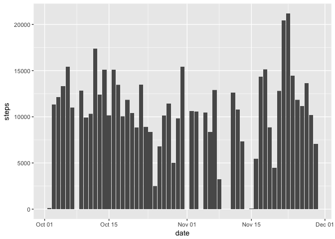
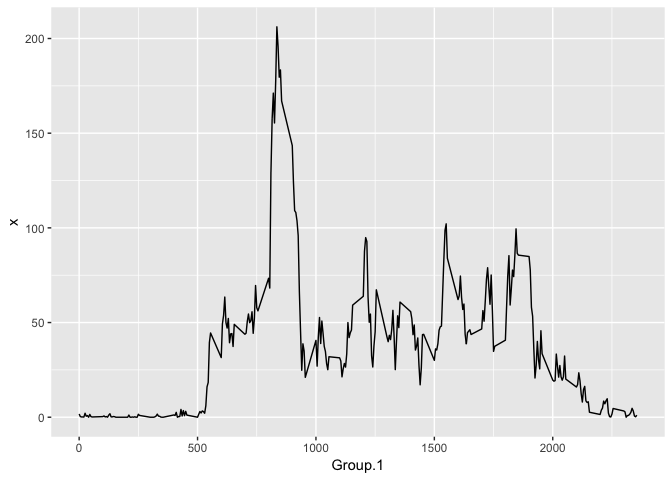
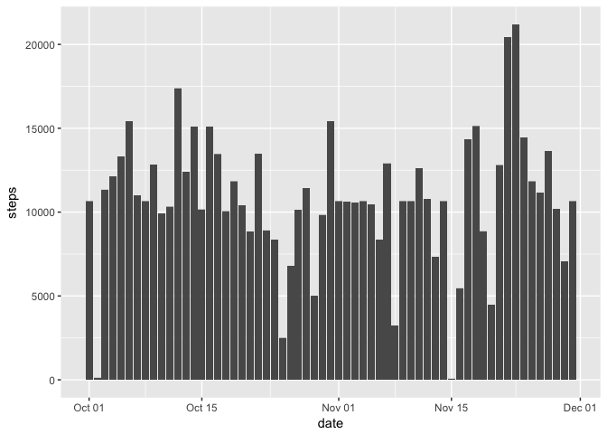
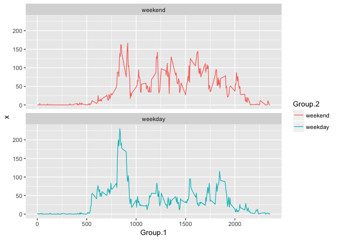

# Reproducible Research: Peer Assessment 1


## Loading and preprocessing the data

```r
library(ggplot2)
data<- read.csv("activity.csv")
data$date<-as.Date(data$date)
```


## What is mean total number of steps taken per day?


```r
# Calculate the total number of steps taken per day
perDay<-aggregate(data$steps, list(data$date), sum)

# Make a histogram of the total number of steps taken each day
ggplot(data, aes(x=date, y=steps))+geom_bar(stat = "identity")
```

```
## Warning: Removed 2304 rows containing missing values (position_stack).
```

<!-- -->

```r
#ggplot(perDay, aes(x=Group.1, y=x))+geom_bar(stat = "identity")

# mean and median of the total number of steps taken per day
mean(perDay$x, na.rm = TRUE)
```

```
## [1] 10766.19
```

```r
median(perDay$x, na.rm = TRUE)
```

```
## [1] 10765
```


## What is the average daily activity pattern?

```r
perInterval<-aggregate(data$steps, list(data$interval), mean, na.rm=TRUE)

# Make a time series plot
ggplot(perInterval, aes(x=Group.1, y=x))+geom_line()
```

<!-- -->

```r
# Which 5-minute interval, contains the maximum number of steps?
perInterval[which(perInterval$x== max(perInterval$x)),1] 
```

```
## [1] 835
```

## Imputing missing values

```r
# Calculate and report the total number of missing values in the dataset
sum(is.na(data$steps))
```

```
## [1] 2304
```

```r
# Create a new dataset that is equal to the original dataset 
imputeData<-data

# Devise a strategy for filling in all of the missing values in the dataset
imputeData[is.na(imputeData$steps),1]<- as.integer(perInterval$x)

# Make a histogram of the total number of steps taken each day
ggplot(imputeData, aes(x=date, y=steps))+geom_bar(stat = "identity")
```

<!-- -->

```r
# Calculate and report the mean and median
perDayImputed<-aggregate(imputeData$steps, list(imputeData$date), sum)
mean(perDay$x, na.rm = TRUE)
```

```
## [1] 10766.19
```

```r
median(perDay$x, na.rm = TRUE)
```

```
## [1] 10765
```

Do these values differ from the estimates from the first part of the assignment? 
    Yes
    
What is the impact of imputing missing data on the estimates of the 
total daily number of steps?
    It has increased

## Are there differences in activity patterns between weekdays and weekends?

```r
weekdays1 <- c('Monday', 'Tuesday', 'Wednesday', 'Thursday', 'Friday')

# Create a new factor variable in the dataset with two levels 
imputeData$wDay <- factor((weekdays(imputeData$date) %in% weekdays1),levels=c(FALSE, TRUE), labels=c('weekend', 'weekday'))

perIntervalImpute<-aggregate(imputeData$steps, list(imputeData$interval, imputeData$wDay), mean)

# Make a panel plot containing a time series plot
ggplot(perIntervalImpute , aes(x=Group.1, y=x, color = Group.2,group=Group.2))+geom_line()+facet_wrap(~Group.2,nrow = 2)
```

<!-- -->
